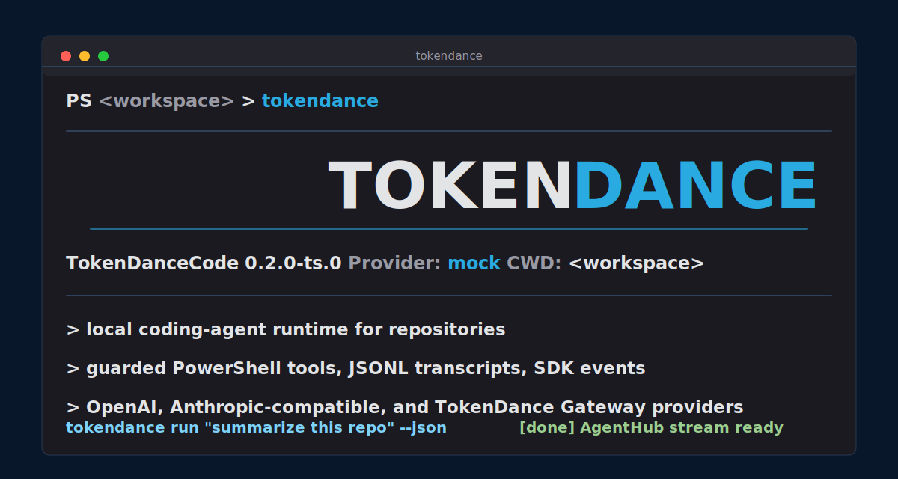

# TokenDanceCode

> Local Coding Agent Runtime — TypeScript + Rust dual-engine



[中文](README.md) · [AgentHub SDK](docs/agenthub-sdk.md) · [Release readiness](docs/release-readiness.md)

---

## What Is TokenDanceCode

TokenDanceCode is a **local command-line Coding Agent**. Run `tokendance` inside a repository to:

- 📖 **Read code** — search files, regex matching, glob patterns
- ✏️ **Edit files** — exact-string replacement, full-file write
- ⚡ **Run commands** — PowerShell tool with permission-gated execution
- 🔄 **Manage sessions** — JSONL transcript, session resume, context compaction
- 🤖 **Extend capabilities** — MCP tool protocol, subagent orchestration

Designed for **personal repos**, **Windows / PowerShell first**, with an **embeddable AgentHub SDK**.

## Dual-Engine Architecture

TokenDanceCode maintains both TypeScript and Rust implementations in the same repository — feature-aligned, API-compatible:

| | TypeScript | Rust |
|---|---|---|
| **Location** | `packages/` | `crates/` |
| **Tests** | Vitest (pnpm verify) | cargo test (204 tests) |
| **Runtime** | Node.js | Native binary |
| **npm packages** | `@tokendance/code-*` | Forwarded via wrapper shim |
| **Status** | ✅ Production-ready | ✅ Core feature parity |

Both implementations **coexist** sharing `docs/`, `scripts/`, and CI config. The npm wrapper prefers the Rust binary and falls back to TypeScript.

## Quick Start

### Rust (recommended)

```bash
git clone https://github.com/TokenDanceLab/TokenDanceCode.git
cd TokenDanceCode
cargo run -p tokendance-cli -- --version     # tokendance 0.3.0-rs.0
cargo run -p tokendance-cli -- doctor --json  # health check
cargo run -p tokendance-cli -- run "hello"    # single turn
cargo test --workspace                        # 204 tests
```

### TypeScript

```bash
pnpm install
pnpm verify                                   # typecheck + vitest
node packages/cli/dist/main.js --version
node packages/cli/dist/main.js doctor --json
```

### Interactive REPL

```bash
cargo run -p tokendance-cli                   # enter interactive mode
tokendance> read the main.rs file
tokendance> summarize this repo
tokendance> /help
tokendance> /exit
```

## Features

### 🔧 Built-in Tools (7)

| Tool | Risk | Description |
|------|------|-------------|
| `read_file` | Read | Read workspace files with path safety checks |
| `write_file` | Write | Write files, permission-gated |
| `edit_file` | Write | Exact-string replace (`old_string` → `new_string`), `replace_all` support |
| `glob` | Read | File pattern matching, sorted by modification time |
| `grep` | Read | Regex search with content/files_with_matches/count modes |
| `run_powershell` | Shell | Execute PowerShell commands, destructive commands hard-denied |
| `echo` | Read | Test echo tool |

### 🌐 Provider Transports (3)

| Provider | Auth | Transport Gate |
|----------|------|----------------|
| OpenAI Chat Completions | `TOKENDANCE_GATEWAY_API_KEY` → `OPENAI_API_KEY` | `TOKENDANCE_GATEWAY_HTTP_TRANSPORT=1` |
| OpenAI Responses | `TOKENDANCE_OPENAI_API_KEY` → `OPENAI_API_KEY` | `TOKENDANCE_OPENAI_TRANSPORT=1` |
| Anthropic Messages | `TOKENDANCE_ANTHROPIC_API_KEY` → `ANTHROPIC_API_KEY` | `TOKENDANCE_ANTHROPIC_TRANSPORT=1` |

All providers automatically redact API keys from error messages.

### 🛡️ Security

- **4 permission modes**: Default → Safe → Auto → Yolo
- **Tool risk classification**: Read / Write / Shell / Network / Dangerous
- **Path safety**: Workspace path normalization, blocks directory traversal and symlink escape
- **Destructive command interception**: PowerShell `Remove-Item`, `format-volume` hard-denied
- **Sandboxing abstraction**: Windows restricted token / macOS Seatbelt / Linux bwrap

### 🔌 Extensibility

| System | Description |
|--------|-------------|
| **MCP Client** | stdio JSON-RPC protocol, dynamic tool discovery, `mcp__{server}__{tool}` namespacing |
| **Subagent** | Isolated session + restricted tool set + recursion prevention, multi-agent orchestration |
| **Hooks** | PreToolUse / PostToolUse / TurnCompleted / TurnFailed lifecycle hooks |
| **Memory** | Markdown file persistent memory, cross-session context |
| **Instruction Discovery** | Auto-discover AGENTS.md / CLAUDE.md, Global → Project → Local scope hierarchy |

### 📡 Sessions & Streaming

- **JSONL Transcript** — append-only, crash-recoverable, UUID parent chain
- **SSE Streaming** — incremental buffering, multi-line data, comment skipping
- **StreamEvent** — ContentDelta / ToolStarted / TurnCompleted real-time events
- **Session Resume** — replay transcript to restore full message history
- **Context Compaction** — auto-compress old messages above threshold

## Project Structure

```
TokenDanceCode/
├── crates/                          # Rust implementation
│   ├── tokendance-core/             #   Runtime, Provider, Tools, Permissions
│   ├── tokendance-sdk/              #   AgentHub SDK facade
│   └── tokendance-cli/              #   CLI binary
├── packages/                        # TypeScript implementation
│   ├── core/                        #   Runtime, Provider, Tools
│   ├── sdk/                         #   AgentHub SDK
│   ├── cli/                         #   CLI + REPL
│   └── agenthub-example/            #   Integration example (private)
├── docs/                            # Shared documentation
├── scripts/                         # Verification & release scripts
├── Cargo.toml                       # Rust workspace
├── package.json                     # npm workspace
└── README.md
```

## CLI Commands

```bash
tokendance                              # Interactive REPL
tokendance run "summarize this repo"    # Single turn
tokendance run --json "hello"           # Structured JSON output
tokendance run --stream-json "hello"    # Streaming JSONL output
tokendance doctor --json                # Health check
tokendance config validate --json       # Config validation
tokendance sessions list                # List sessions
tokendance transcript search "needle"   # Search transcripts
tokendance quality                      # Quality overview
```

REPL slash commands: `/help` `/status` `/exit` `/compact`

## AgentHub SDK

```ts
import { TokenDanceCode } from "@tokendance/code-sdk";

const client = new TokenDanceCode({
  storageRoot: "~/.tokendance",
  env: process.env,
  eventSink(event) { console.log(event.type); }
});

const thread = client.startThread({
  workingDirectory: process.cwd(),
  permissionMode: "default"
});

const turn = await thread.run("summarize this repo");
console.log(turn.finalResponse);
```

See [AgentHub SDK docs](docs/agenthub-sdk.md) for full integration guide.

## Rust Modules (20 modules, 204 tests)

| Module | Function |
|--------|----------|
| `config` | Settings loading / validation / merge |
| `permissions` | 4-mode permission engine |
| `provider` | ModelProvider trait + MockProvider |
| `providers/*` | OpenAI Chat / Responses / Anthropic HTTP transports |
| `runtime` | Agent loop + streaming + hooks integration |
| `tools` | 7 built-in tools + ToolExposure + MCP registration |
| `transcript` | JSONL append / session resume |
| `streaming` | SSE incremental parser |
| `context` | Instruction discovery (AGENTS.md / CLAUDE.md) |
| `memory` | Persistent memory CRUD |
| `hooks` | Lifecycle hooks |
| `mcp` | MCP client (stdio JSON-RPC) |
| `subagent` | Subagent spawning / isolation |
| `compact` | Context compaction |
| `sandbox` | Cross-platform sandboxing abstraction |
| `worktree` | Git worktree management |
| `types` | Core types + RuntimeEvent |

## Verification

```bash
# Rust gates
cargo fmt --all -- --check
cargo test --workspace                    # 204 tests
cargo run -p tokendance-cli -- doctor

# TypeScript gates
pnpm verify

# Release readiness
node scripts/check-rust-release-plan.mjs
node scripts/smoke-rust-release.mjs
```

## Documentation

| Document | Content |
|----------|---------|
| [Architecture](docs/rust-rewrite-architecture.md) | Rust rewrite architecture — 20 module design decisions |
| [Status](docs/rust-rewrite-status.md) | Phase 1–5 completion record, module status |
| [Tool Reference](docs/rust-tool-reference.md) | 7 built-in tools input/output schemas |
| [Release Checklist](docs/rust-release-checklist.md) | Release owner pre-publish checklist |
| [AgentHub SDK](docs/agenthub-sdk.md) | SDK integration, event sink, approval bridge |
| [Release Readiness](docs/release-readiness.md) | npm publish gates and registry status |
| [Architecture Comparison](docs/架构对标评估.md) | Claude Code / Codex / OpenCode comparison |

## License

MIT
