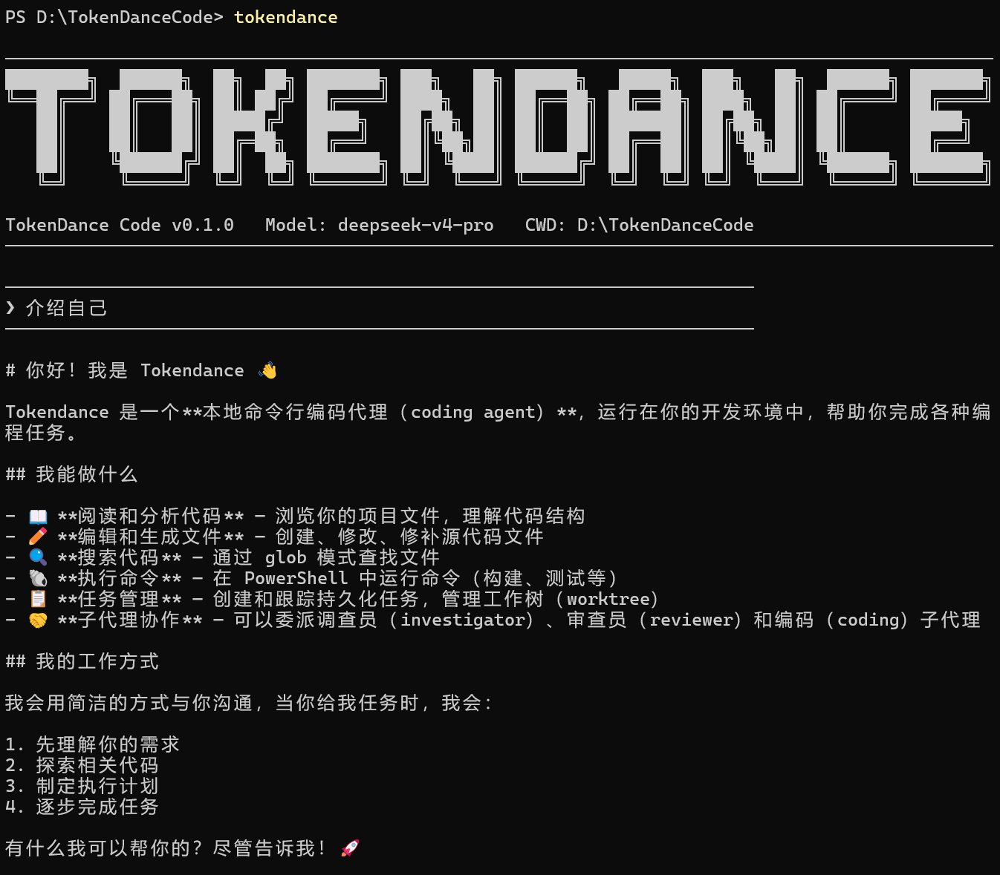

# TokenDanceCode

TokenDanceCode 是一个面向个人开发者的本地命令行 Coding Agent。

你可以在任意本地代码仓库中打开终端，运行 `tokendance`，然后让它阅读项目、修改文件、运行 PowerShell 命令、检查 Git diff、管理任务和 Todo，并把会话过程保存为 transcript。

`codex/ts-refactor` 分支正在把项目重构为 TypeScript monorepo。目标体验接近 Claude Code / Codex CLI，但实现保持自用 Agent 框架的克制范围：薄 CLI、可嵌入 SDK、结构化事件流、JSONL transcript、统一工具权限管线、Windows / PowerShell 优先。

当前定位很窄：TokenDanceCode 是本地 CLI / harness，不是云平台、团队协作系统、IDE 插件、插件市场或 AgentHub 的替代品。团队协作和多 Agent 工作流由 AgentHub 承担，TokenDanceCode 专注个人开发者在本地仓库里的编码代理体验。

包名和全局命令都是：

```powershell
tokendance
```



## TS 重构当前状态

当前分支已经建立 TypeScript 第一批可验证闭环：

- `@tokendance/code-core`：session、event、runtime、tool registry、permission engine、JSONL transcript store、task/todo/subagent/worktree store、MockProvider。
- `@tokendance/code-sdk`：AgentHub 可消费的 `TokenDanceCode -> Thread -> run/runStreamed/context` 编程接口，支持 provider 配置、审批回调、事件下沉、AgentHub runtime event 映射、recent transcript resume、session lifecycle metadata/export/prune candidates/diagnostics、transcript search、task/todo/subagent/worktree facade，以及 TokenDanceID OIDC Authorization Code + PKCE 登录启动 helper。
- `@tokendance/code-cli`：薄 CLI 入口，支持 `--version`、`doctor`、`run <prompt>`、分组帮助、可读 status/config/doctor 输出、Gateway 首次配置提示、最小交互式 REPL、context preview、task/todo/subagent/worktree 管理和工具事件渲染。
- `@tokendance/code-agenthub-example`：私有示例包，演示 AgentHub emitter 如何通过 SDK 接收 `agent.stream` payload、桥接远程审批，并从 AgentHub shell 启动 TokenDanceID OIDC 登录 URL。
- `pnpm verify`：同时执行 TypeScript typecheck 和 Vitest 测试。

旧 Python `src/tokendance` 和 `tests/` 暂时保留为功能迁移参考，不再作为 TS 重构分支新增能力的默认落点。后续迁移按 [docs/TS重构路线图.md](docs/TS重构路线图.md) 推进。

## 目标功能

- 交互式终端 Coding Agent。
- 支持模型流式输出。
- 支持 OpenAI Responses API、OpenAI Chat Completions API / TokenDance Gateway 和 Anthropic-compatible Messages API。
- 内置文件工具：`read_file`、`write_file`、`edit_file`、`glob`。
- 内置 patch 和 PowerShell 工具，并经过权限系统管控。
- 支持 slash commands：状态、配置、diff、review、quality、tasks、todo、transcript、memory、resume、worktree 等。
- 每次会话都会保存 JSONL transcript。
- Git 能力内置：diff、review、revert、quality gate、worktree。
- Windows / PowerShell 是一等支持环境。

## 当前成熟度

| 模块 | 状态 | 说明 |
|---|---|---|
| CLI 入口 | 可用 | `tokendance`、`tokendance --version`、`tokendance doctor`、`tokendance resume` |
| 交互 shell | 可用 | 滚动式终端体验，支持 slash commands 和 MockProvider 冒烟 |
| OpenAI Responses provider | 可用 | `OPENAI_API_KEY + MODEL_ID` 会推断为 `openai-responses` |
| OpenAI Chat Completions / Gateway provider | 可用 | `TOKENDANCE_GATEWAY_API_KEY + TOKENDANCE_MODEL` 会推断为 `openai-chat-completions` |
| Anthropic-compatible provider | 可用 | `ANTHROPIC_API_KEY + MODEL_ID` 会推断为 `anthropic-messages` |
| 文件、patch、PowerShell 工具 | 可用 | 经过权限系统执行 |
| Git / diff / review / quality | 可用 | 面向本地仓库的结构化能力 |
| Task / Todo / transcript / memory / resume | 可用但早期 | 适合开发和自用验证，仍需更多端到端打磨 |
| Subagent / worktree | 可用但实验中 | 面向隔离修改型子任务，不是常驻团队系统 |

## 环境要求

- Node.js 20.18 或更高版本。
- pnpm 10 或更高版本。
- Git。
- Windows 下推荐使用 PowerShell。
- 如果要使用真实模型，后续需要 OpenAI 或 Anthropic-compatible API key。

如果没有配置 API key，当前 TS runtime 可以使用 MockProvider，适合做 SDK、CLI 和 transcript 冒烟测试。

## 从源码安装

克隆仓库：

```powershell
git clone https://github.com/TokenDanceLab/TokenDanceCode.git
cd TokenDanceCode
```

安装依赖：

```powershell
pnpm install
```

验证项目：

```powershell
pnpm verify
pnpm pack:check
pnpm release:next:check
```

`pnpm pack:check` 会先构建全部 TS 包，再对 `@tokendance/code-core`、`@tokendance/code-sdk`、`@tokendance/code-cli` 执行 dry-run 打包检查，随后运行 `pnpm pack:smoke`。`pnpm pack:smoke` 会把三个真实 tarball 安装到临时项目中，验证 SDK import、mock turn、CLI bin 启动、`doctor --json` 的 AgentHub readiness / `provider-ready`，以及 `quality --json` 的结构化输出，确认 AgentHub 可消费包只包含发布所需内容。

确认命令可用：

```powershell
pnpm --filter @tokendance/code-cli build
node packages/cli/dist/main.js --version
node packages/cli/dist/main.js quickstart
node packages/cli/dist/main.js doctor
node packages/cli/dist/main.js doctor --json
```

`quickstart` 是只读首次上手提示，会串起安装验证、provider 选择、TokenDance Gateway preset、TokenDanceID 登录 URL helper，以及 `doctor`/`config` 检查。它不会写入 env 文件、打印密钥、打开浏览器、发布 npm 包或触碰生产环境。交互式 REPL 中对应 `/quickstart`。

`doctor` 会按 Runtime、API Keys、Tools、Config、State 分组输出 Node、cwd、platform、OpenAI/Anthropic API key 是否存在、Git/PowerShell 可用性、配置文件路径/source、有效 provider/model、provider readiness 和 `.tokendance` 状态目录可写性。API key 只显示 `present`/`missing`，不会打印密钥值；真实 provider 缺少 key/model 会在 readiness 和 AgentHub Hub startup check 中显示为 `warn`，不会阻断本地 mock 或 Hub 启动自检。需要给脚本或 AgentHub 调试面板读取时使用 `doctor --json`；交互式 REPL 中对应 `/doctor json`。

运行一次 mock turn：

```powershell
node packages/cli/dist/main.js run "hello"
```

期望输出 `Mock response: hello`。

## 配置模型

TokenDanceCode TS 版当前已提供 OpenAI Responses API、OpenAI Chat Completions API 与 Anthropic-compatible Messages API provider adapter。CLI 默认仍使用 MockProvider；AgentHub 或本地脚本可通过 SDK 显式选择 provider。

CLI 会读取有效配置来启动 `tokendance` 交互式 session 和 `tokendance run`：`provider`/`model` 决定 SDK provider，`permissionMode` 决定新 session 的初始权限模式。未配置时默认是 `mock` provider、`mock` model 和 `default` permission mode。设置 `MODEL_ID` 加对应 provider key 时，CLI 会从 env 推断 provider；例如 `ANTHROPIC_API_KEY + MODEL_ID` 使用 `anthropic-messages`，`OPENAI_API_KEY + MODEL_ID` 使用 `openai-responses`，`TOKENDANCE_GATEWAY_API_KEY + TOKENDANCE_MODEL` 使用 `openai-chat-completions`。需要 OpenAI-compatible `/v1/chat/completions` 时显式设置 `TOKENDANCE_PROVIDER=openai-chat-completions`。

Provider key/base URL 优先级按协议隔离：

| Provider | API key | Base URL | 协议 |
|---|---|---|---|
| `openai-responses` | `OPENAI_API_KEY` | `OPENAI_BASE_URL`，默认 `https://api.openai.com/v1` | `POST /v1/responses` |
| `openai-chat-completions` | `TOKENDANCE_GATEWAY_API_KEY`，缺省回退 `OPENAI_API_KEY` | `TOKENDANCE_GATEWAY_BASE_URL`，缺省回退 `OPENAI_BASE_URL`，默认 `https://api.openai.com/v1` | `POST /v1/chat/completions` |
| `anthropic-messages` | `ANTHROPIC_API_KEY` | `ANTHROPIC_BASE_URL`，默认 `https://api.anthropic.com` | `POST /v1/messages` |

Provider HTTP 失败会统一抛出 `ProviderApiError`，包含 `provider`、`protocol`、`status`、可用的 upstream `type/code` 和不含密钥的诊断 message。非 JSON 错误响应会归一化为同一异常类型。

真实 provider / TokenDance Gateway smoke 是显式 opt-in：默认测试只跑 mock fetch、配置预检和 skip gate，不读取项目根目录 `.env`，也不会使用真实 key。需要真实模型 smoke 时，只在受控 PowerShell 会话或全局 `~/.tokendance/.env` 设置：

```powershell
$env:TOKENDANCE_RUN_REAL_PROVIDER_SMOKE = "1"
$env:OPENAI_API_KEY = "your-api-key"
$env:TOKENDANCE_OPENAI_RESPONSES_TEST_MODEL = "gpt-5.4"
$env:TOKENDANCE_GATEWAY_API_KEY = "your-tokenDance-api-key"
$env:TOKENDANCE_OPENAI_CHAT_TEST_MODEL = "deepseek-v4-pro"
$env:ANTHROPIC_API_KEY = "your-api-key"
$env:TOKENDANCE_ANTHROPIC_TEST_MODEL = "claude-sonnet-4-6"
```

`preflightProviderSmoke()` / `shouldRunProviderIntegration()` 只返回 `ready` 或 `skip`、缺失的 env 名和不含 secret 的提示。TokenDance Gateway smoke 使用 `TOKENDANCE_GATEWAY_API_KEY` 或 OpenAI fallback key；TokenDanceID/OIDC access token 和 Hub session token 仍属于身份会话平面，不是模型 API key。

配置可以放在以下位置：

- 当前 PowerShell 会话环境变量。
- 全局 `~/.tokendance/.env`。

安全提示：TokenDanceCode 默认不读取项目根目录 `.env` 作为 provider key 来源。项目 `.env` 通常属于业务配置，可能包含应用密钥；需要给 AgentHub 或脚本注入 provider key 时，优先通过 SDK `env` 显式传入受控环境。

项目或全局 JSON 配置可以通过 CLI 写入安全白名单字段：

```powershell
node packages/cli/dist/main.js config set provider openai-chat-completions model deepseek-v4-pro permission-mode safe
node packages/cli/dist/main.js config --json
node packages/cli/dist/main.js config validate
node packages/cli/dist/main.js config validate --json
node packages/cli/dist/main.js config set --json provider openai-chat-completions model deepseek-v4-pro permission-mode safe
node packages/cli/dist/main.js config set --global provider anthropic-messages model claude-sonnet-4-6 permission-mode default
```

`config --json` 输出与 SDK `client.config()` 同源的结构化 payload，适合 AgentHub shell、启动向导或脚本读取。`config validate` 检查当前 provider/model 是否具备运行所需环境，文本模式未 ready 时返回非 0，`--json` 返回与 SDK `client.validateConfig()` 同源的结构化结果。`config set` 只写入 `provider`、`model`、`permissionMode` 到 `.tokendance/config.json` 或 `~/.tokendance/config.json`，并会拒绝 `apiKey`、`token`、`secret` 等非白名单字段；`config set --json` 会额外返回 `scope` 和 `savedPath`。Provider key 继续放在受控环境变量或全局 `~/.tokendance/.env`，不要写入 JSON 配置。

### 方式一：当前 PowerShell 会话

使用 Anthropic 官方接口：

```powershell
$env:ANTHROPIC_API_KEY = "your-api-key"
$env:MODEL_ID = "claude-sonnet-4-6"
```

使用 OpenAI Responses API：

```powershell
$env:OPENAI_API_KEY = "your-api-key"
$env:MODEL_ID = "gpt-5.4"
```

使用 Anthropic-compatible 第三方接口，例如 DeepSeek：

```powershell
$env:ANTHROPIC_API_KEY = "your-api-key"
$env:ANTHROPIC_BASE_URL = "https://api.deepseek.com/anthropic"
$env:MODEL_ID = "deepseek-v4-pro"
```

### 方式二：全局 `.tokendance/.env`

在用户目录创建 `~/.tokendance/.env`：

```env
ANTHROPIC_API_KEY=your-api-key
MODEL_ID=claude-sonnet-4-6
```

DeepSeek-compatible 示例：

```env
ANTHROPIC_API_KEY=your-api-key
ANTHROPIC_BASE_URL=https://api.deepseek.com/anthropic
MODEL_ID=deepseek-v4-pro
```

OpenAI-compatible Gateway 示例：

```powershell
node packages/cli/dist/main.js gateway init --model deepseek-v4-pro
```

该命令会写入全局 `~/.tokendance/.env` 的 provider/model/base URL preset，不会生成、覆盖或打印 API key。命令输出会给出下一步：设置 `TOKENDANCE_GATEWAY_API_KEY`、运行 `tokendance config` 确认配置，并提示 TokenDance API key 与 TokenDanceID 登录 token 是不同凭据平面。随后在同一个全局 env 文件或当前 shell 中设置：

```env
TOKENDANCE_GATEWAY_API_KEY=your-tokenDance-api-key
TOKENDANCE_GATEWAY_BASE_URL=https://api.vectorcontrol.tech/v1
TOKENDANCE_MODEL=deepseek-v4-pro
TOKENDANCE_PROVIDER=openai-chat-completions
```

TokenDance Gateway 的模型调用使用 TokenDance API key；TokenDanceID/OIDC 登录属于 AgentHub/Hub 或管理界面的身份会话平面，不应当作为 Gateway 模型 API key 使用。

TokenDanceCode 默认不读取项目根目录 `.env` 作为自身 provider key 来源。项目 `.env` 通常属于业务配置，可能包含应用密钥；需要给 AgentHub 或脚本注入 provider key 时，优先通过 SDK `env` 显式传入受控环境。

## 启动使用

当前 TS CLI 支持一次性 mock 运行和恢复历史 session：

```powershell
node packages/cli/dist/main.js quickstart
node packages/cli/dist/main.js run "完整阅读这个项目"
node packages/cli/dist/main.js config
node packages/cli/dist/main.js config --json
node packages/cli/dist/main.js config validate --json
node packages/cli/dist/main.js config set provider openai-chat-completions model deepseek-v4-pro permission-mode safe
node packages/cli/dist/main.js auth tokendanceid login-url --client-id agenthub-local --redirect-uri http://127.0.0.1:48731/callback
node packages/cli/dist/main.js gateway init --model deepseek-v4-pro
node packages/cli/dist/main.js resume
node packages/cli/dist/main.js resume <session-id>
node packages/cli/dist/main.js sessions
node packages/cli/dist/main.js transcript
node packages/cli/dist/main.js transcript <session-id>
node packages/cli/dist/main.js transcript search <query>
node packages/cli/dist/main.js transcript <session-id> search <query>
node packages/cli/dist/main.js context --session <session-id> "preview next turn"
node packages/cli/dist/main.js memory
node packages/cli/dist/main.js memory add project "Use pnpm verify before commits"
node packages/cli/dist/main.js memory delete project 0
node packages/cli/dist/main.js agents
node packages/cli/dist/main.js agents run reviewer "Inspect task store"
node packages/cli/dist/main.js agents run coding --worktree stage15-agent "Prepare isolated change"
node packages/cli/dist/main.js agents show agent-0001
node packages/cli/dist/main.js agents accept agent-0001 --discard-worktree
node packages/cli/dist/main.js agents discard agent-0001 --discard
node packages/cli/dist/main.js tasks
node packages/cli/dist/main.js tasks create "Stage 15 E2E"
node packages/cli/dist/main.js tasks done task-1
node packages/cli/dist/main.js todo
node packages/cli/dist/main.js todo add "Run unittest" --task task-1
node packages/cli/dist/main.js todo doing todo-1
node packages/cli/dist/main.js worktree
node packages/cli/dist/main.js worktree create stage15-wt
node packages/cli/dist/main.js worktree remove stage15-wt
node packages/cli/dist/main.js diff
node packages/cli/dist/main.js review
node packages/cli/dist/main.js tools
node packages/cli/dist/main.js quality
node packages/cli/dist/main.js quality "pnpm verify"
node packages/cli/dist/main.js compact
node packages/cli/dist/main.js compact <session-id>
```

工具调用会通过同一套 runtime 事件流渲染，例如 mock echo 工具：

```powershell
node packages/cli/dist/main.js run "echo: hello"
```

会依次显示工具开始、权限决策、工具完成或失败原因，以及最终响应。

交互式入口：

```powershell
node packages/cli/dist/main.js
```

当前已支持：

```text
/new
/status
/quickstart
/permissions safe
/sessions
/agents
/tasks create Stage 15 E2E
/todo add Run unittest --task task-1
/worktree
hello
/exit
```

当前 SDK 可供 AgentHub 或本地脚本嵌入：

```ts
import { TOKEN_DANCE_CODE_PACKAGE, TokenDanceCode } from "@tokendance/code-sdk";

console.log(TOKEN_DANCE_CODE_PACKAGE.packages.sdk.name);
console.log(TOKEN_DANCE_CODE_PACKAGE.verification.test);

const client = new TokenDanceCode();
const thread = client.startThread({ workingDirectory: process.cwd() });
const turn = await thread.run("summarize repo");
console.log(turn.finalResponse);

const resumed = await client.resume({ storageRoot: process.cwd() });
console.log(resumed.recentTranscript.length);

const transcript = await resumed.transcript();
console.log(transcript.transcriptPath);

const matches = await resumed.searchTranscript("needle");
console.log(matches.map((match) => `${match.seq}:${match.eventType}`));
const sessionMatches = await client.sessions({ storageRoot: process.cwd() }).searchTranscript(resumed.id, "needle");
console.log(sessionMatches.map((match) => match.preview));
const exported = await client.sessions({ storageRoot: process.cwd() }).export(resumed.id);
console.log(exported.eventCount, exported.transcriptJsonl.length);
const pruneCandidates = await client.sessions({ storageRoot: process.cwd() }).pruneCandidates({ keepLatest: 20 });
console.log(pruneCandidates.map((session) => `${session.sessionId}:${session.reason}`));
const resumeDiagnostic = await client.sessions({ storageRoot: process.cwd() }).diagnose(resumed.id);
console.log(resumeDiagnostic.ok, resumeDiagnostic.reason);

const preview = await resumed.context("preview next turn");
console.log(preview.includedFiles);

const memory = client.memory({ projectRoot: process.cwd() });
await memory.add("project", "Use pnpm verify before commits.");
console.log(await memory.list("project"));

const tasks = client.tasks({ projectRoot: process.cwd() });
const task = await tasks.create({ title: "Stage 15 E2E" });
await tasks.updateStatus(task.id, "completed");

const todos = client.todos({ projectRoot: process.cwd(), sessionId: "session-id" });
const todo = await todos.add({ text: "Run unittest", taskId: task.id });
await todos.updateStatus(todo.id, "in_progress");

const subagents = client.subagents({ projectRoot: process.cwd() });
const agent = await subagents.runReadonly({ agentType: "reviewer", prompt: "Inspect task store" });
console.log(agent.summary);
console.log(await subagents.get(agent.id));
const acceptedAgent = await subagents.runCoding({ prompt: "Prepare isolated change", worktree: "stage15-agent", taskId: task.id });
await subagents.accept(acceptedAgent.id, { discardWorktree: true });
const throwawayAgent = await subagents.runCoding({ prompt: "Try disposable change", worktree: "throwaway-agent" });
await subagents.discard(throwawayAgent.id, { discard: true });

const worktrees = client.worktrees({ repositoryRoot: process.cwd() });
const worktree = await worktrees.create({ name: "stage15-wt" });
console.log(worktree.path, worktree.dirty);
await worktrees.remove("stage15-wt");

const tools = client.tools({ workingDirectory: process.cwd() });
console.log(tools.list().map((tool) => `${tool.name}:${tool.risk}`));
const status = await tools.execute("git_status");
console.log(status.ok);

const config = await client.config({ projectRoot: process.cwd() });
console.log(config.config.provider, config.config.model);

const validation = await client.validateConfig({ projectRoot: process.cwd() });
console.log(validation.validation.ready, validation.validation.missing);

const savedConfig = await client.setConfig(
  { provider: "openai-chat-completions", model: "deepseek-v4-pro", permissionMode: "safe" },
  { projectRoot: process.cwd() }
);
console.log(savedConfig.projectConfigPath);

const doctor = await client.doctor({ projectRoot: process.cwd() });
console.log(doctor.git.available, doctor.stateDir.writable);
console.log(doctor.config.validation.ready, doctor.startup.hub.ok);
```

SDK 也提供 TokenDanceID OIDC 登录 URL helper。它只生成 Authorization Code + PKCE 登录参数并校验 callback `state`；真正 code exchange、JWKS 验证、`tokendance_sub` 映射和 Hub-local session 仍由 AgentHub Hub Server 负责。

CLI 也提供同源登录 URL 生成入口，便于本地壳层或 AgentHub 调试面板复制：

```powershell
node packages/cli/dist/main.js auth tokendanceid login-url `
  --client-id agenthub-local `
  --redirect-uri http://127.0.0.1:48731/callback `
  --json
```

该命令不打开浏览器、不交换 authorization code、不保存 TokenDanceID token；输出中的 `codeVerifier` 只供 Hub 后端完成本轮 PKCE exchange。

```ts
import { createTokenDanceIdLoginRequest, verifyTokenDanceIdCallback } from "@tokendance/code-sdk";

const login = createTokenDanceIdLoginRequest({
  clientId: "agenthub-local",
  redirectUri: "http://127.0.0.1:48731/callback"
});

console.log(login.authorizationUrl);

const callback = verifyTokenDanceIdCallback("http://127.0.0.1:48731/callback?code=...&state=...", login);
console.log(callback.codeVerifier);
```

AgentHub 集成可以接管审批和事件分发：

```ts
import { TokenDanceCode } from "@tokendance/code-sdk";

const client = new TokenDanceCode({
  provider: { type: "openai-chat-completions", model: "deepseek-v4-pro", baseUrl: "https://api.vectorcontrol.tech/v1" },
  storageRoot: "D:/Code/TokenDance/AgentHub/.tokendance-code",
  env: process.env,
  approvalCallback(request) {
    return request.tool.risk !== "dangerous";
  },
  eventSink(event) {
    console.log(event.type);
  }
});
```

需要对接 AgentHub `run.agent.*` 事件时，可使用 `createAgentHubEventSink()` 或 `toAgentHubRuntimeEvents()`；需要 Hub/UI 异步审批时，可使用 `createAgentHubApprovalBridge()`。

需要可复制的 Hub/Edge emitter 示例时，可参考私有 workspace 包 `packages/agenthub-example`。详细说明见 [docs/agenthub-sdk.md](docs/agenthub-sdk.md)。

## Slash Commands

当前 TS 版已支持：

```text
/help
/new
/status
/doctor
/doctor json
/config
/config json
/config validate json
/config set provider <provider> model <model> permission-mode <mode>
/permissions default
/permissions safe
/permissions auto
/permissions yolo
/resume
/memory
/memory add project <text>
/memory delete project <index>
/auth tokendanceid login-url --client-id <id> --redirect-uri <uri> [--json]
/agents
/agents run investigator <prompt>
/agents run reviewer <prompt>
/agents run coding [--worktree name] <prompt>
/agents show <agent-id>
/agents accept <agent-id> [--discard-worktree] [--allow-dirty-target]
/agents discard <agent-id> [--discard]
/tasks
/tasks create <title>
/tasks doing <task-id>
/tasks done <task-id>
/tasks link-session <task-id> <session-id>
/tasks link-worktree <task-id> <worktree>
/todo
/todo add <text> [--task task-id]
/todo doing <todo-id>
/todo done <todo-id>
/worktree
/worktree create <name>
/worktree remove <name> [--discard]
/diff
/review
/tools
/quality
/quality pnpm verify
/transcript
/transcript search <query>
/context <prompt>
/compact
/exit
```

权限模式说明：

- `default`：默认受保护模式。
- `safe`：写入和高风险操作更谨慎。
- `auto`：自动允许更多常规操作。
- `yolo`：限制最少，使用时要小心。

## 项目结构

```text
TokenDanceCode/
├── package.json
├── pnpm-workspace.yaml
├── tsconfig.base.json
├── README.md
├── docs/
├── packages/
│   ├── core/         # runtime、session state、events、tools、permissions、transcript
│   ├── sdk/          # AgentHub 和脚本调用的稳定编程接口
│   ├── cli/          # tokendance 命令入口与最小交互 shell
│   └── agenthub-example/ # AgentHub SDK 集成样例
├── src/tokendance/   # Python v0.1 参考实现，TS 迁移期间保留
└── tests/            # Python v0.1 参考测试，TS 迁移期间保留
```

## 文档地图

| 文档 | 用途 |
|---|---|
| [`docs/产品功能需求文档.md`](docs/产品功能需求文档.md) | 产品定位、目标用户、非目标范围、命令体验、权限、记忆、任务和验收范围 |
| [`docs/架构设计文档.md`](docs/架构设计文档.md) | Core Runtime、CLI Shell、provider、tool、permission、storage、context、git 和 subagent 边界 |
| [`docs/开发流程文档.md`](docs/开发流程文档.md) | 从脚手架到 subagent/worktree 的阶段化开发计划和每阶段验收标准 |
| [`docs/端到端验收清单.md`](docs/端到端验收清单.md) | Windows/PowerShell 下的安装、配置、CLI、工具、Git、task/todo、subagent 验收脚本 |

## 开发与测试

安装开发依赖：

```powershell
pnpm install
```

运行 TS 闭环：

```powershell
pnpm verify
```

运行单项：

```powershell
pnpm typecheck
pnpm test
```

## npm next 预发布基线

TokenDanceCode 的 public npm 包当前是 `@tokendance/code-core`、`@tokendance/code-sdk`、`@tokendance/code-cli`。`@tokendance/code-agenthub-example` 仍是私有 workspace 示例包，不进入 npm 发布队列。

预发布前检查：

```powershell
pnpm release:next:check
pnpm pack:smoke
```

`pnpm release:next:check` 等价于 `pnpm verify && pnpm pack:check`。它覆盖 typecheck、Vitest、构建、dry-run pack 和本地 tarball install smoke。不要在检查脚本中执行 npm publish；`npm publish --tag next` 只作为人工审核后的单包发布动作，由 release owner 在确认版本、dist-tag、包内容和 npm 登录状态后执行。

### Release owner 检查清单

Manual approval gate：`pnpm release:next:check` 和 `pnpm pack:smoke` 只证明本地源码、构建产物、dry-run pack 和临时项目安装闭环可用；它们不会登录 npm、不会改 dist-tag、不会发布任何包。真正执行 `npm publish --tag next` 前，release owner 需要逐包确认以下事项。

| 检查项 | 期望证据 |
|---|---|
| 版本与 dist-tag | 根包和三个 public 包版本一致，`publishConfig.tag` 为 `next` |
| 包内容 | `pnpm pack:smoke` 已安装真实 tarball，验证 SDK mock turn、CLI `doctor --json` / `quality --json`，且包内只包含 `dist`、`README.md` 和 npm 必需 manifest 文件 |
| README 一致性 | 根 README 与 package-local README 都说明包职责、AgentHub 消费方式、pack smoke 和手动发布边界 |
| 凭据边界 | 发布检查不读取或打印 provider key；npm 登录状态只由 release owner 在本机确认 |
| 人工发布 | `npm publish --tag next` 只能在显式批准后对 `@tokendance/code-core`、`@tokendance/code-sdk`、`@tokendance/code-cli` 逐包执行 |

### AgentHub consumption story

AgentHub 只应把 `@tokendance/code-sdk` 当作稳定消费入口。Hub/Edge/Desktop/Web 可以读取 `TOKEN_DANCE_CODE_PACKAGE` 做启动检查，使用 `TokenDanceCode -> Thread -> run()/runStreamed()/context()` 执行本地 coding-agent turn，通过 `createAgentHubEventSink()` 或 `createAgentHubAgentStreamSink()` 投递 runtime events，并用 `createAgentHubApprovalBridge()` 接入远程审批。`@tokendance/code-core` 是 SDK/CLI 的 shared runtime，业务集成不应直接依赖 core internals；`@tokendance/code-cli` 提供人工或脚本启动的 `tokendance` bin；`@tokendance/code-agenthub-example` 仍是私有复制样例，不进入 npm 发布队列。

### Residual risk matrix

| 风险 | 当前状态 | 发布前处理 |
|---|---|---|
| 真实 provider 环境未配置 | MockProvider、provider readiness 和 real-smoke preflight 覆盖本地验证，真实模型 smoke 默认跳过 | release owner 只在需要真实模型 smoke 时显式配置 `TOKENDANCE_RUN_REAL_PROVIDER_SMOKE=1`、API key 和测试模型 env，不把 key 写入仓库或项目 `.env` |
| npm 账号和 dist-tag 状态不可由 CI 证明 | 本地检查不触碰 npm registry 写操作 | Manual approval gate 后由 release owner 逐包确认 npm login、2FA 和 `next` tag |
| AgentHub 生产接入仍需产品侧验证 | SDK contract、event sink、approval bridge 和私有 example 已测试 | AgentHub 合并时复用 SDK 边界，并用 Hub 自己的 event bus、approval store 和 session 生命周期替换样例数组 |
| Python v0.1 参考实现仍保留 | TS 分支不再扩展旧 Python runtime | 后续迁移时继续用路线图和验收清单清理旧验收项 |

包 README 策略：

- 根 `README.md` 说明源码安装、开发、AgentHub SDK 集成和发布前验证。
- `packages/core/README.md` 面向 runtime 包消费者，强调多数应用应优先使用 SDK。
- `packages/sdk/README.md` 面向 AgentHub 和本地脚本集成，展示 SDK 入口和 manifest。
- `packages/cli/README.md` 面向全局命令安装和 CLI 启动检查。

检查 CLI：

```powershell
tokendance doctor
```

## 给新用户的注意事项

- 在哪个目录运行 `tokendance`，哪个目录就是当前 workspace root。
- 会话 transcript 会保存到当前项目的 `.tokendance/` 下。
- `glob` 工具默认排除 `.git`、`.tokendance`、虚拟环境、缓存目录、build/dist、`node_modules` 和 `.env`。
- CLI 通过 runtime event 渲染工具开始、权限决策、工具完成耗时、失败原因、成功结果摘要和 assistant 文本；结构化 permission reason 会压缩成 `risk/action/mode/tool` 元数据和可读详情。测试默认保持纯文本，设置 `FORCE_COLOR=1` 时 renderer 会对工具、权限状态、工具风险、失败状态和 usage 数字使用 ANSI 高亮，usage 行同时显示 input/output/total token 数。
- CLI 帮助按 Core、Session、Work、Diagnostics、Gateway 分组；交互式 `/status`、`/config`、`/doctor` 使用小节输出，便于扫描但仍保持薄 CLI。
- 真实模型 smoke 默认跳过，需要显式设置 `TOKENDANCE_RUN_REAL_PROVIDER_SMOKE=1`、对应 API key 和测试模型 env 后才会运行；默认测试不读取项目根目录 `.env`。
- AgentHub 集成应使用 SDK 的 `approvalCallback` / `createAgentHubApprovalBridge()` 和 `eventSink`，不要直接调用 core runtime 内部类。
- `doctor` 只输出 API key 是否存在，不输出 secret 值；配置输出也只展示白名单字段、路径和 provider readiness。真实 provider 未 ready 会作为 startup warning 暴露给 AgentHub，不会让 Hub `ok` 变成 `false`。

## 当前状态

TokenDanceCode TS 版目前还是早期本地 Agent 实现，适合开发、测试和自用验证。

它还不是正式发布到 npm 的包。当前已有发布前 `release:next:check`、`pack:check` 和 `pack:smoke` 检查；后续会继续补充正式发布流程、首次运行向导、完整 TUI、更多 slash commands、更细的事件 renderer 和更完整的 AgentHub 端到端示例。
